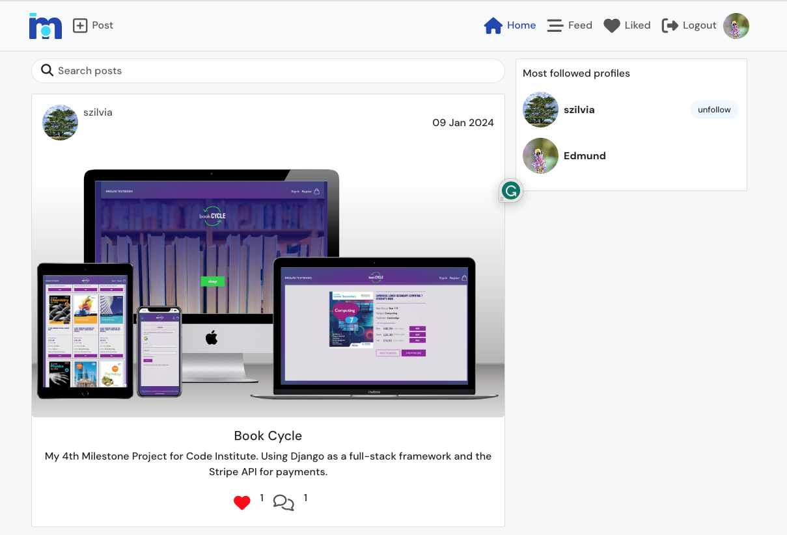

# Moments - social_app

Live site: https://social-app-szilvia-8965907d743d.herokuapp.com/

## BACKEND

**Back-end framework** is Django REST (`Django @4` & `Django Rest Framework @3`).

**Database** is written in `PostgreSQL`, hosted on `ElephantSQL`.

**Authentication** with JSON Web Tokens, implemented with: `dj-rest-auth`, `django-allauth` and `djangorestframework-simplejwt`.

**Image** management with `Pillow`, stored on `Cloudinary`.

**Static files** storage with `Whitenoise`.

## FRONTEND

### React + TypeScript + Vite

### Packages

* `react-bootstrap` & `bootstrap`
* `axios`
* `react-router-dom v6`
* `react-infinite-scroll-component`
* `serve` - for hosting on Heroku

## CREDITS

* Design and styles: by Code Institute.
* The basis of this project was Code Institute's `Moments` app. While the look & feel of my app is very similar, I implemented several fundamental changes which resulted in a completely different code. The changes I made are as follows:

   * On the Frontend:
      - I used `TypeScript` instead of JavaScript, 
      - used `@vite` instead of react-create-app for setup,
      - `react-router-dom v6` instead of v5 for routing (v6 was a major upgrade),
      - I managed state values with reducers whenever it was necessary to avoid unneccessary re-renders instead of using several useState() values,
      - used Bootstrap v5 instead of v4

   * On the Backend:
      - Django v4 instead of v3 and I used newer versions for django-restframework as well as djangorestframework-simplejwt too, my API endpoints are different.
      - I used a completely different approach for authentication, login & logout.
   

* Other resources:
   * Favicon generator: https://realfavicongenerator.net/
   * Converting svg to png: https://svgtopng.com/